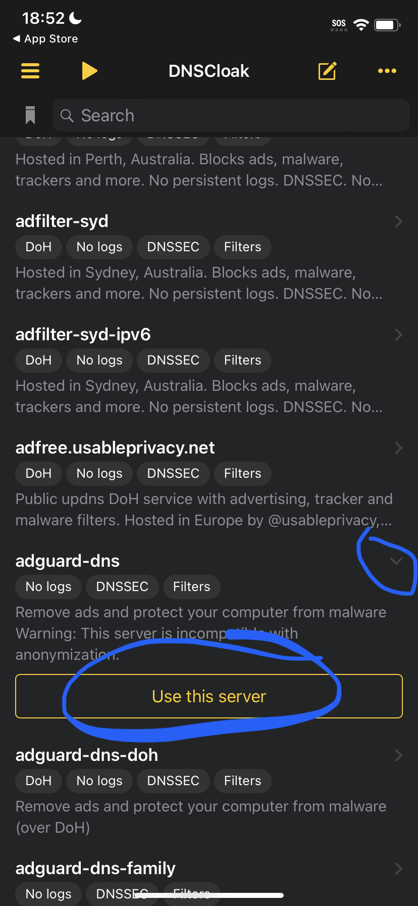
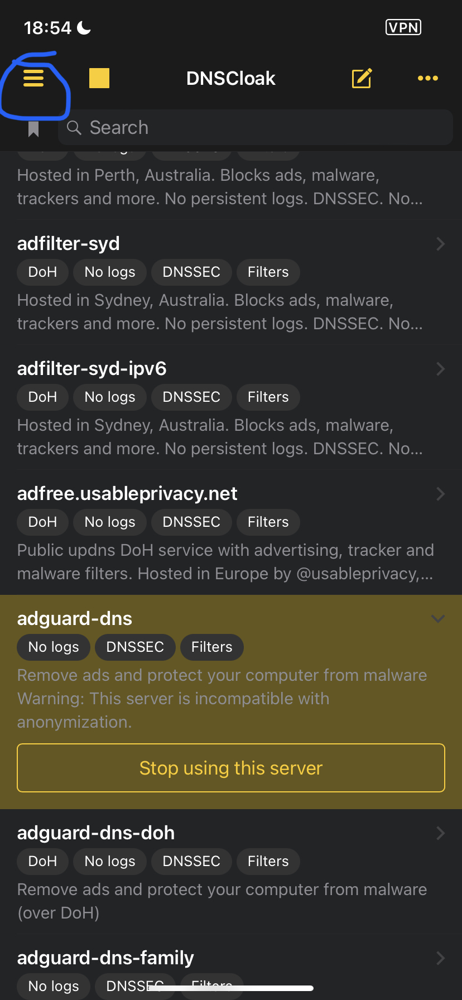
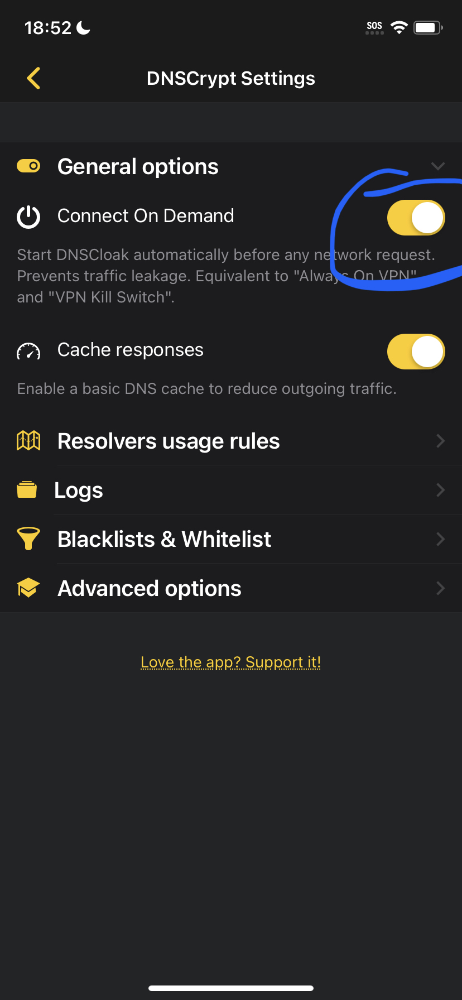
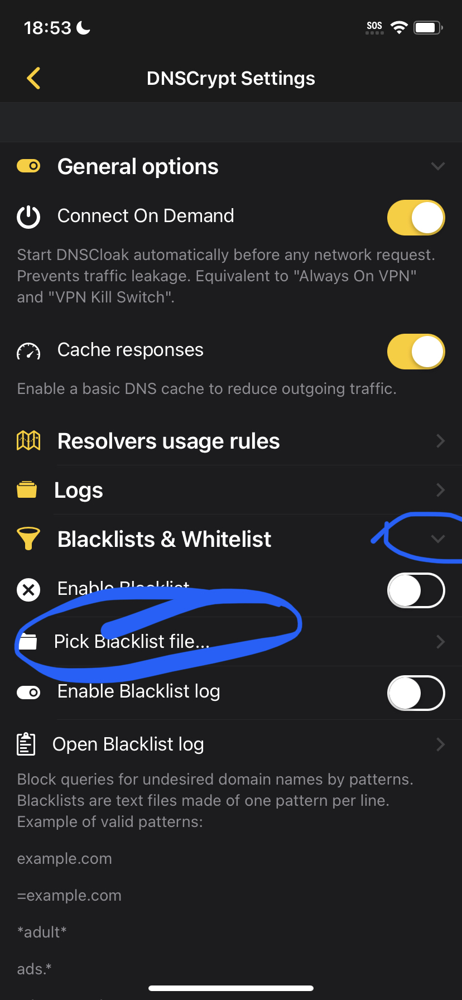

# Anti-Revoke


To verify new Scarlet apps the anti-revoke must be disabled


## Steps

1. Install DNSCloak from the Appstore ([https://apps.apple.com/app/dnscloak-secure-dns-client/id1452162351](https://apps.apple.com/app/dnscloak-secure-dns-client/id1452162351))
2. Select an option on the main screen and click "Use this server"
3. Click the three line icon at the top left
4. Enable "Connect on Demand"
5. Select "Pick Blacklist file" and import the one [here](http://resources.usescarlet.com/blacklist.php)

<figure><figcaption></figcaption></figure>

 

<figure><figcaption></figcaption></figure>

 

<figure><figcaption></figcaption></figure>

 

<figure><figcaption></figcaption></figure>

