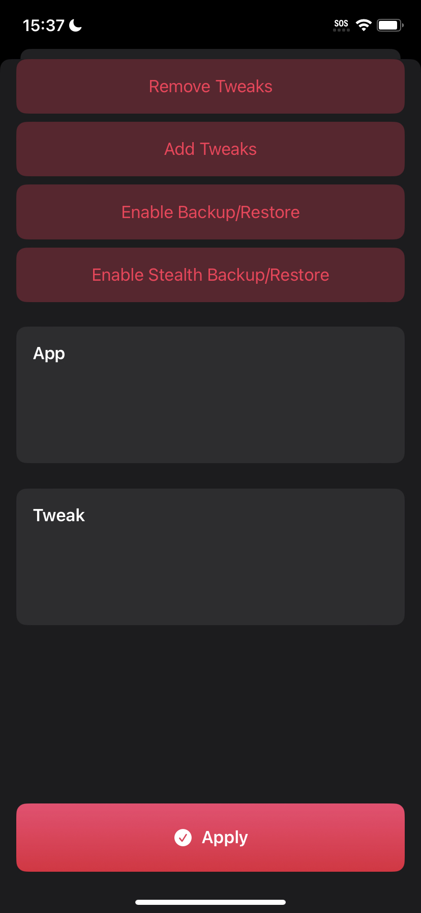

# Backup/Restore (Normal)


If you have an app that crashes on open using this method or run into other issues you can try the [Stealth backup](backup-restore-stealth.md) option.


### Steps

1. Go to the "Modify IPA" menu in Scarlet
2. Select "Enable Backup/Restore"
3. Hit Apply at the bottom

You may now backup your app at any point by simply pressing on the app icon on your homescreen and clicking "Backup". This will let you select where to save the ".scripa" backup file.

To restore all you need to do is use the normal Scarlet sideload button on your backup file and it'll install the app with all it's contents.

<figure><figcaption></figcaption></figure>

 

<figure><figcaption></figcaption></figure>

 

<figure><figcaption></figcaption></figure>

 

<figure><figcaption></figcaption></figure>

