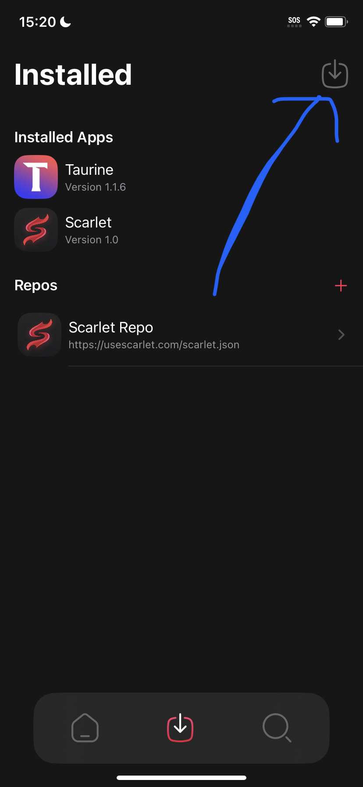
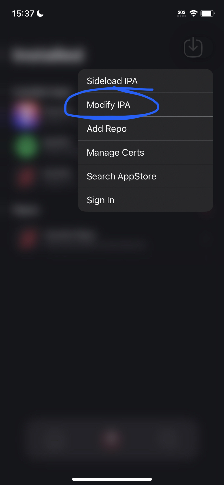

# Backup/Restore (Stealth)


Use this if [normal Backup/Restore](backup-restore-normal.md) does not work on your app


### Steps

1. Go to the "Modify IPA" menu in Scarlet
2. Select "Enable Stealth Backup/Restore"
3. Hit Apply at the bottom

### How to Backup and Restore

1. In the Scarlet installed section click the icon of the app you want to backup.
2. Click "Backup Helper" - this will install an app over the current one that has the backup and restore ability. Don't worry none of your app progress is gone.
3. You may now press on the app icon on your homescreen and you'll have the option to "Backup" and "Restore

<figure><figcaption></figcaption></figure>

 

<figure><figcaption></figcaption></figure>

 

<figure><figcaption></figcaption></figure>

 

<figure><figcaption></figcaption></figure>

