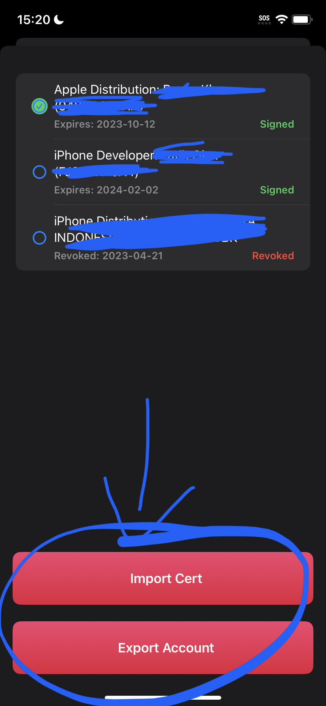

# Certificates / Developer Login

If you are enrolled in [Apple's official developer program](https://developer.apple.com/programs/) or have your own [Apple certificate](https://www.udidregistrations.com) you can import that into Scarlet for installs.\

**Getting Started**\
1\. First to get started you need the Scarlet app. You can either download Scarlet direct or sideload the Scarlet IPA with a computer.\
\
2\. Now that you have Scarlet you can now enter the "Manage Cert" menu by hard pressing the sideload button in Scarlet

3. Use the "Export Account" or "Import Certificate" options.

<figure><figcaption></figcaption></figure>

 

<figure><figcaption></figcaption></figure>

 

<figure><figcaption></figcaption></figure>

