# Features

## Accessibility

Scarlet can be installed many ways either from the [official Scarlet computer method](broken-reference), [Direct install method](scarlet-direct/), or [importing your own certificate for app installs](certificates-developer-login.md).

## Backup/Restore Apps

Scarlet allows you to easily backup and restore your apps.&#x20;

Tutorial: [https://twitter.com/GetScarlet/status/1649876107489935365?s=20](https://twitter.com/GetScarlet/status/1649876107489935365?s=20)

## Repo System

Scarlet can add jailbroken repos and you can use this to tweak apps or install jailbroken apps to a **non-jailbroken** format.

You can make your own JSON repos for Scarlet that you can tell what debs or dylibs to inject into the IPA and much more ([format](https://usescarlet.com/scarlet.json)).

<figure>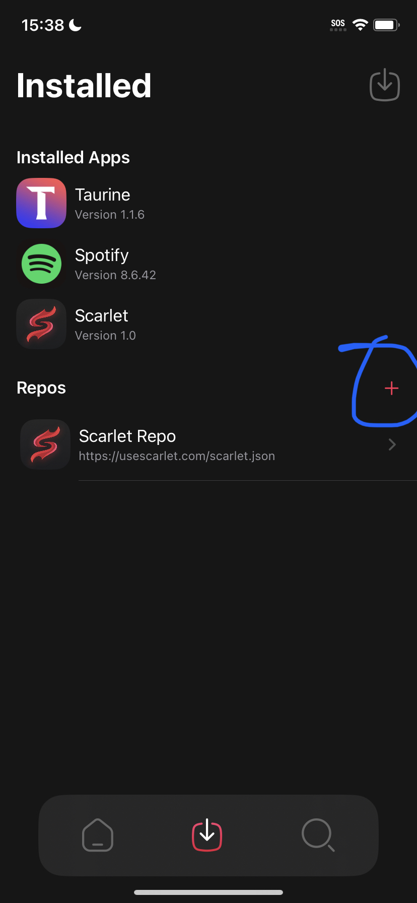<figcaption></figcaption></figure>

 

<figure>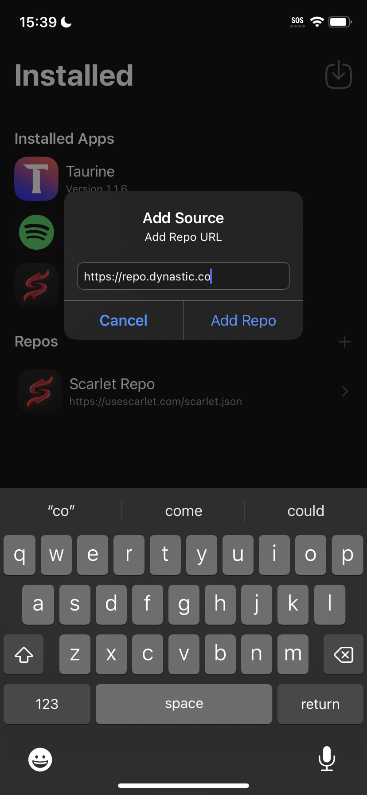<figcaption></figcaption></figure>

 

<figure>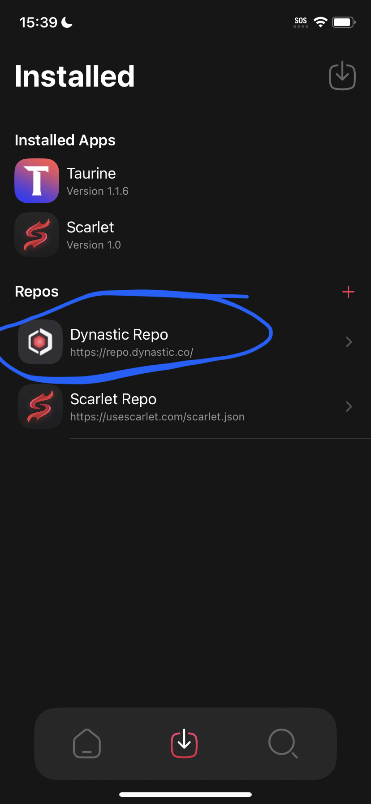<figcaption></figcaption></figure>

## Manage Conflicts

This can be enabled from the iOS settings app and will list you the features that aren't compatible with the current certificate or mobileprovision, so you have a better understanding of what will not work.

<figure>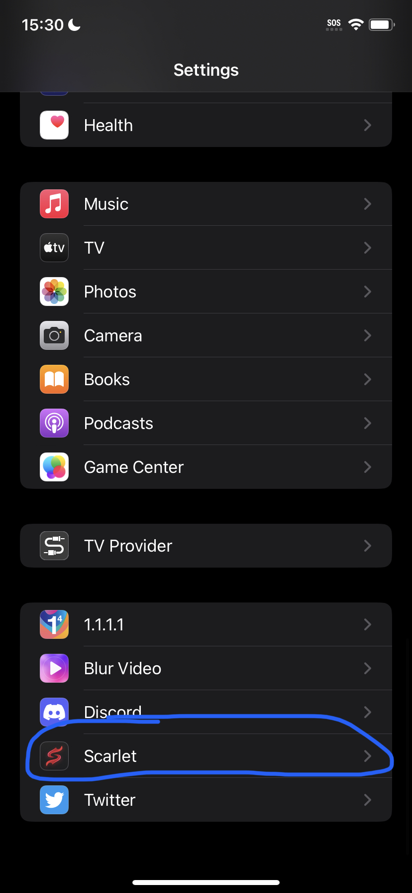<figcaption></figcaption></figure>

 

<figure>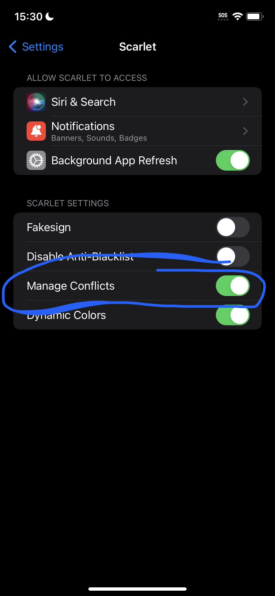<figcaption></figcaption></figure>

 

<figure>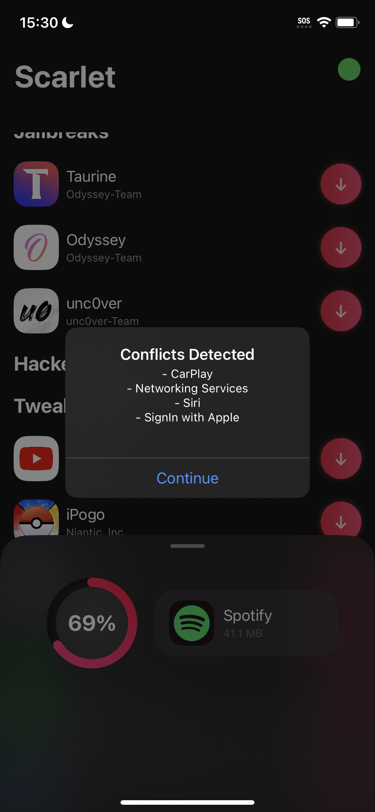<figcaption></figcaption></figure>

## Tweaking

* Scarlet allows you to import your own deb or dylib using the normal sideload button in Scarlet. You'll then be prompted to choose an IPA to tweak.
* You may also import jailbroken repos into Scarlet and click on a tweak you would like to inject into an app.
* You can use the Scarlet "Modify IPA" menu to bulk inject tweaks or bulk remove tweaks from an app.

<figure>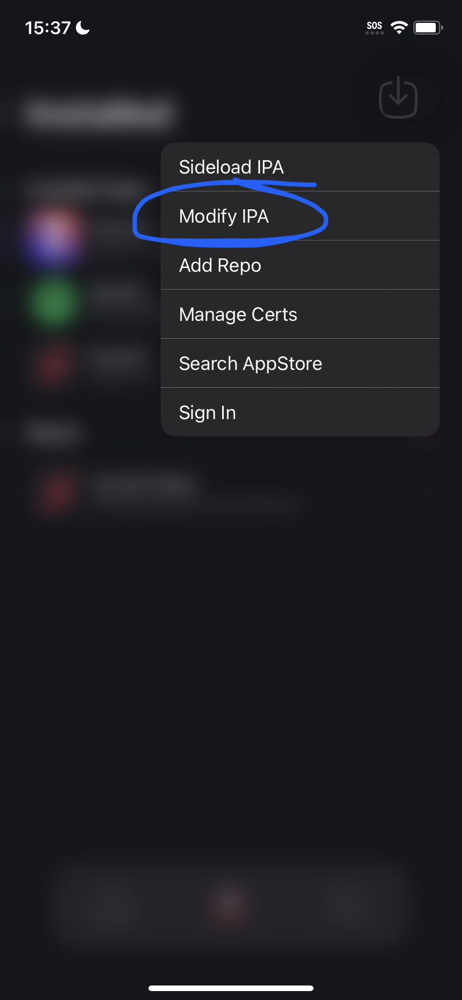<figcaption></figcaption></figure>

 

<figure>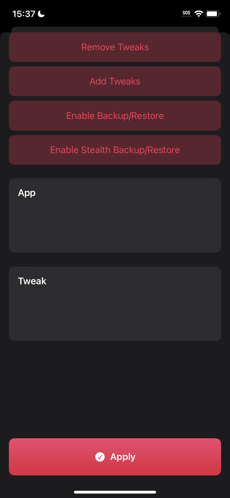<figcaption></figcaption></figure>

## Manage Certificates

Scarlet gives you full control to view the status of the certificates used in Scarlet and allows you to import your own.

<figure>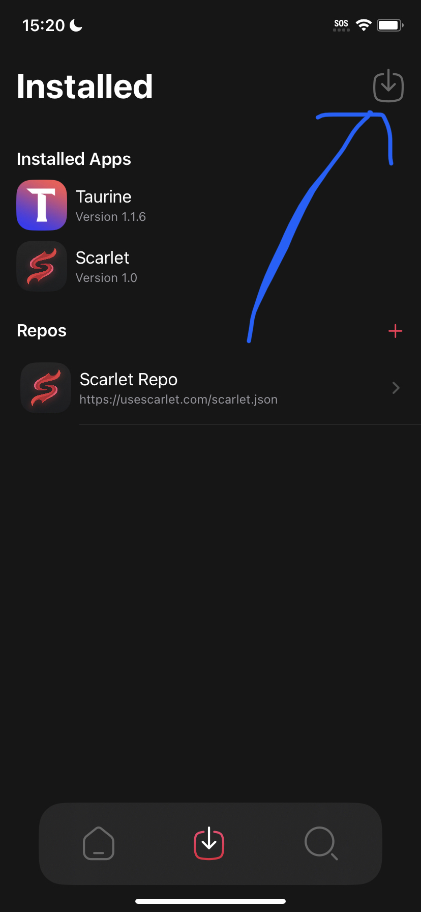<figcaption></figcaption></figure>

 

<figure>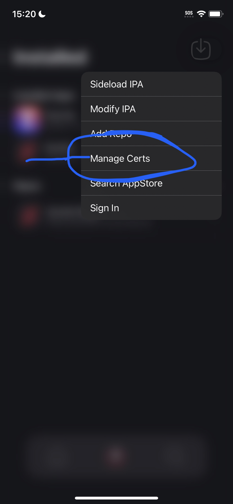<figcaption></figcaption></figure>

 

<figure>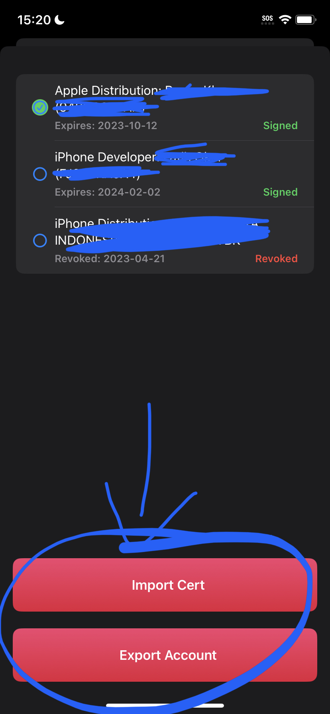<figcaption></figcaption></figure>

