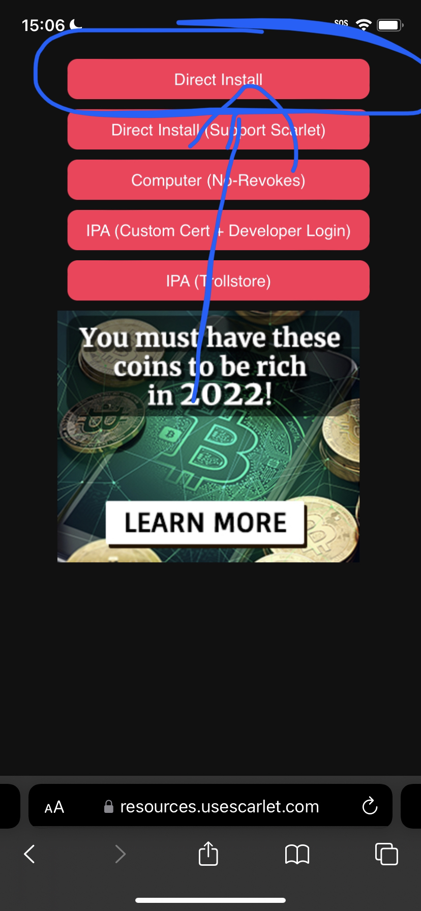
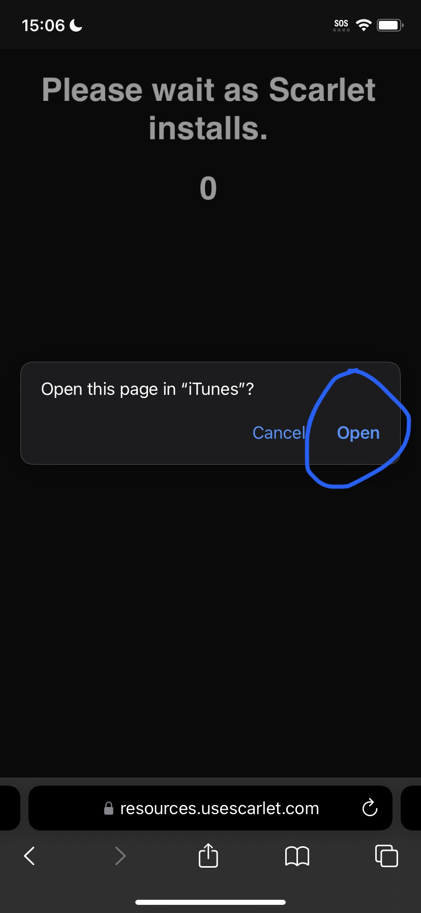

# Scarlet Direct

If you don't have a [computer](broken-reference) this is the choice for you.

There are two caveats. [Revocations](revokes.md) are a common occurrence and [blacklists ](blacklists.md)are a possibility. This makes it so apps can last a few days or weeks, but you can reinstall Scarlet from the site when it says "Signed".

To save your app/game progress watch this short video on Twitter:

[https://twitter.com/GetScarlet/status/1649876107489935365?s=20](https://twitter.com/GetScarlet/status/1649876107489935365?s=20)

<figure><figcaption></figcaption></figure>

 

<figure><figcaption></figcaption></figure>

